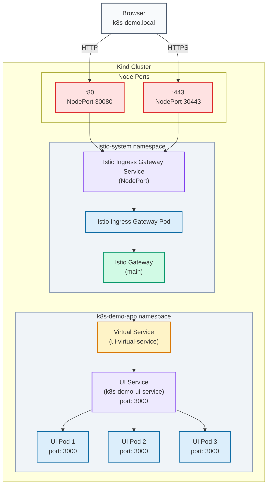

# Getting Started

- Standup the `kind` cluster by executing: `kind create cluster --config ./kind/kind-config.yaml`

- Install Flux using the script found in `./flux2`.

- Create a `secrets.yaml` somewhere in your project. Ensure that it is `.gitignore`'d since this will contain your GitHub/GitLab PAT.

```yaml
apiVersion: v1
kind: Secret
metadata:
  name: git-credentials
  namespace: flux
type: Opaque
stringData:
  username: <YOUR_GITHUB_USERNAME>
  password: <YOUR_GITHUB_PAT>
```

You can verify that flux has connected to your repository by running `kubectl get gitrepo -n flux` and viewing the status.

- Once the GitRepo has connected, you can run `kubectl apply -f flux-kustomize.yaml` to have flux observe and reconcile changes to project resources.

- Verify that the istio ingress gateway is up by using `kubectl get gateway -n istio-system`. Check that the UI is available by running: `curl -L -H "Host: k8s-demo.local" http://localhost -v`, you will need to trust the `certs/ca.crt` on your machine to connect via curl.

> In Ubuntu: `sudo cp certs/ca.crt /usr/local/share/ca-certificates/ && sudo update-ca-certificates`<br/><br/>
If working in WSL2 or using `snap`, you can trust the CA in Firefox by executing the following command: `CERT_DIR=/home/<YOUR_USER>/snap/firefox/common/.mozilla/firefox/<ID>.default/; certutil -d 
sql:$CERT_DIR -A -t "C,," -n "Istio Ingress CA" -i certs/ca.crt`

# Routing through the ingress
